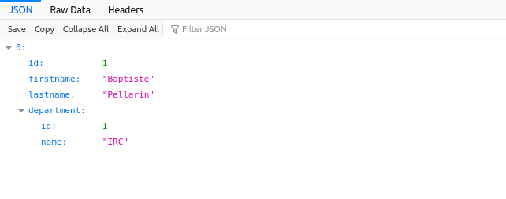
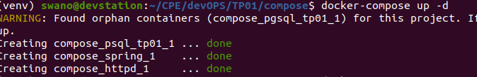

# TP01 - Baptiste PELLARIN
31/01/2022
------

I. PostgresSQL
---

Il est important d'avoir les mots de passes sockés en lieu sûr.
Le Dockerfile a pour finalité d'être archivé dans un système de controle de version.
Ce n'est donc pas le bon emplacement pour socker des mots de passe ou secrets.

Commande exécutée (1-1) :

```bash
$ docker build -t tp01_postgresql .

$ docker run -d -e POSTGRES_DB=$POSTGRES_DB -e POSTGRES_USER=$POSTGRES_USER -e POSTGRES_PASSWORD=$POSTGRES_PASSWORD -p 127.0.0.1:5432:5432 tp01_postgresql
```

I.a: Création d'un volume persistent
----

```bash 
$ docker run -d -v /mnt/tp01_psql:/var/lib/postgresql/data -p 127.0.0.1:5432:5432 tp01_postgresql

$ ls -l /mnt/tp01_psql
total 120
drwx------ 6 70 70  4096 janv. 31 14:17 base
drwx------ 2 70 70  4096 janv. 31 14:17 global
drwx------ 2 70 70  4096 janv. 31 14:17 pg_commit_ts
drwx------ 2 70 70  4096 janv. 31 14:17 pg_dynshmem
-rw------- 1 70 70  4535 janv. 31 14:17 pg_hba.conf
-rw------- 1 70 70  1636 janv. 31 14:17 pg_ident.conf
....
-rw------- 1 70 70    94 janv. 31 14:17 postmaster.pid
```

Ce volume permet aux données de ne plus être liées au conteneur. Cela évite les perte de données en cas de perte du conteneur car, celui-ci a pour principe d'être temporaire.

[Dockerfile](postgres/Dockerfile)

II Backend API
---

Backend Java simple
----

```bash
javac Main.java
```
[Dockerfile](backend_api/simple/Dockerfile)


Multistage build (1-1)
-----

Le multistage build permet de compiler avec tous les outils nécéssaires et de ne garder que les outils nécéssaire au fonctionnement de l'image pour la phase déploiement.

On retire les outils de compilation de l'image de production afin de gagner de la place et de l'efficacité.

Backend java Spring
----

Multistage build (1-2)
-----

La 1ere partie du [Dockerfile](backend_api/Dockerfile) *myapp-build* charge une image de maven avec le jdk 11.
* On créé le dossier de travail dans l'image de compilation (/opt/myapp)
* On copie la configuration de maven et les sources de l'application dans le dossier de travail
* On lance la création de l'executable (*.jar)

Dans la 2eme partie on va prendre une image de java sans aucun outil de compilation. Juste le JRE.
* On créé le répertoire de travail (même que précédement)
* On récupère l'executable créé à l'étape *myapp-build* pour le mettre dans le répertoire de travail avec pour nom *myapp.jar*
* On peut désormait lancer *myapp.jar*

L'image est beaucoup plus petite en passant par ce système.


Spring connecté à psql (JDBC)
---

J'ai réutilisé le même [Dockerfile](simple_api/Dockerfile) que la partie précédente.

J'ai également modiié les dépendences maven et quelques oublis du code pour que le service compile.

Interconnexion entre Spring et la BDD :
------
Pour réaliser l'interconnexion j'ai dû supprimer le conteneur de la base de donnée pour pouvoir le recréé dans un réseau.

J'ai également dû donner un nom au conteneur de base de donnée et placer ce nom dans l'application comme *hostname*

```bash
$ docker network create tp01 
$ docker run -d --network tp01 -v /mnt/tp01_psql:/var/lib/postgresql/data -p 127.0.0.1:5432:5432 --name psql_tp01  tp01_postgresql
$ docker run -it -p 8080:8080 --network tp01 simple_api

```

`application.yml`
```yaml
....
  datasource:
    url: jdbc:postgresql://psql_tp01:5432/tp01
    username: swano
    password: 123456789
    driver-class-name: org.postgresql.Driver
....
```

Résultat:




Serveur HTTP
---

On va spécifier un nom et le réseau de spring ainsi que celui du reverse proxy.
Plus besoin de spécifier de port ouvert pour spring. Le serveur apache sera le seul service exposé à l'extérieur.

(Il faut aussi activer `mod_proxy` dans la configuration apache)

(Dockerfile)[http_server/Dockerfile]

```bash 

$ docker run -d --network tp01 --name spring simple_api
$ docker run -d --network tp01 -p 80:80 --name reverse_proxy reverse_proxy

```

```xml
<VirtualHost *:80>
	ProxyPreserveHost On
	ProxyPass / http://spring:8080/
	ProxyPassReverse / http://spring:8080/
</VirtualHost>
```


Le reverse proxy est utile pour gérer plusieurs services derière un seul serveur web. 
Cela permet de toujours utiliser un seul port (80/443) pour toutes les applications. Même si cela poste un problème de point unique de défaillance.

Les utilisateurs ne se connectent pas à leur service avec un numéro de port mais via le FQND du service.

Résultat :


Docker compose
---

(docker-compose.yml)[compose/docker-compose.yml]

Docker compose est important car il permet de créer des *stack* de logiciels en peu de temps et de manière unifiée.
Il se charge seul de gérer l'interconexion des services, les volumes, les politiques de redémarrage en cas de crash.

(1-4)
```bash
# Docker compose en détaché
$ docker-compose up -d 
# Arret des conteneurs
$ docker-compose stop
# Arrêt du stack et suppression des conteneurs du stack
$ docker-compose down 
# Suppression des conteneurs arrêtés
$ docker-compose rm
```


(1-5)
```yaml
version: '3.7'  # version de la syntax du fichier

services:
 spring:  # nom du service (utilisé dans la configuration du reverse proxy)
  build: ../simple_api/  # Chemin relatif vers le dockerfile 
  networks:
   - tp01  # réseau auquel le conteneur doit-être connecté et accessible via son hostname (spring)
  depends_on:
   - psql_tp01 # on attend que la base de donnée ai démarrée avant de démarrer le service

 psql_tp01:
  build: ../postgres/
  networks:
   - tp01
    
 httpd:
  build: ../http_server/
  networks:
   - tp01
  depends_on:
   - spring # On attend que spring ai démarré (également psql_tp01 implicitement)
  ports:
   - "80:80" # le service est disponible sur le port 80 de la machine hôte

networks:
 tp01:
  driver: bridge # On créé le réseau en moide bridge (le plus adapté à notre besoin)

```

Pour faire mieux je pourrais lier `spring` et `psql_tp01` au réseau `host` pour les isoler complètement de l'extérieur et, ajouter `httpd` dans deux réseau pour qu'il puisse faire la liaison.

Résultat :




Publication
----

1-5

```bash
docker tag tp01_postgresql swano/tp01_postgresql:latest
docker push swano/tp01_postgresql:latest
```
