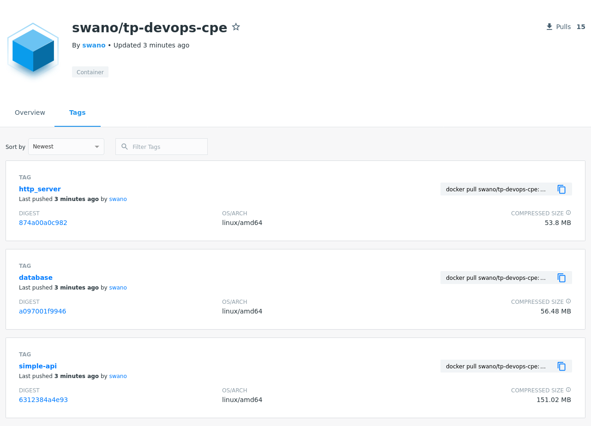
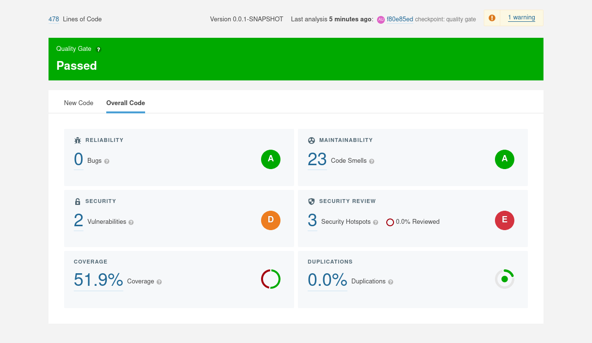

# TP02 - Baptiste PELLARIN
01/02/2022
----

### 2-1 : 
Les *testcontainers* sont des librairies java permettant de créer des conteneurs docker pendant la réalisation de tests.


### 2-2 :

```yaml
name: CI devops 2022 CPE # Nom de la CI
on:
  push:
    branches: # On lance la CI uniquement quand il y a un push sur ces deux branches
      - main
      - develop
    pull_request:
jobs:
  test-backend:
    runs-on: ubuntu-18.04 # Pour réaliser notre build on utilise une base ubuntu
    steps:
      - uses: actions/checkout@v2 # On récupère la bonne version du repo
      - name: Set up JDK 11
        uses: actions/setup-java@v2 # On prépare le jdk pour pouvoir compiler avec maven
        with:
          java-version: '11'
          distribution: 'adopt' # adoptopenjdk ?
      - name: Build with Maven
        run: mvn clean verify
        working-directory: simple_api/ # On réalise le travail dans le dossier de l'application

```

[Job OK](https://github.com/baptiste-pellarin/devops_s8_tp02/runs/5023056642)


## Construction des images docker

On doit absolument utiliser le `needs` car sans les tâches de build et de déploiement seront réalisée en parallèles 

Téléverser une image Docker permet de la rendre accessible pour les serveurs l'executant.

[Pipeline OK](https://github.com/baptiste-pellarin/devops_s8_tp02/runs/5023493580)
[Repo avec les images](https://hub.docker.com/r/swano/tp-devops-cpe/tags)



# SonarCube

[Pipeline OK](https://github.com/baptiste-pellarin/devops_s8_tp02/runs/5023742216)


### 2-3 :

```yaml
...
      - name: Cache SonarCloud packages
        uses: actions/cache@v1
        with:
          path: ~/.sonar/cache
          key: ${{ runner.os }}-sonar # On va enregistrer le cache de sonar pour le réutilise plus tard
          restore-keys: ${{ runner.os }}-sonar

      - name: Cache Maven packages
        uses: actions/cache@v1
        with:
          path: ~/.m2 
          key: ${{ runner.os }}-m2-${{ hashFiles('**/pom.xml') }} # Idem pour maven (on fait le hash du fichier pom afin de ne pas garder de cache en cas de modification)
          restore-keys: ${{ runner.os }}-m2
          
      - name: Build and analyze
        env:
          SONAR_TOKEN: ${{ secrets.SONAR_TOKEN }}
        run: mvn -B verify sonar:sonar -Dsonar.projectKey=baptiste-pellarin_devops_s8_tp02 -Dsonar.organization=baptiste-pellarin -Dsonar.host.url=https://sonarcloud.io -Dsonar.login=${{secrets.SONAR_TOKEN }} --file ./pom.xml # On lance le build et les tests avec l'analyse sonarcube
        working-directory: simple_api/
...
```



